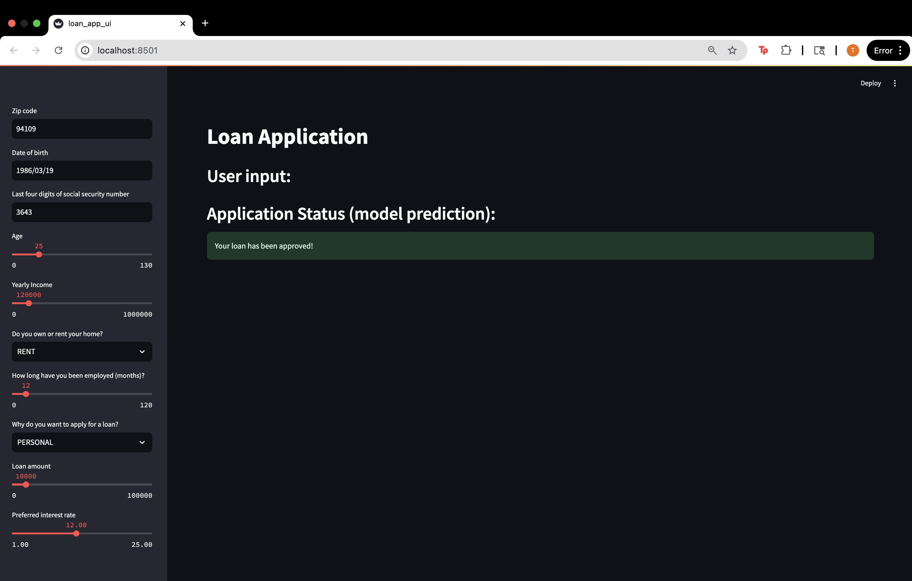

# Loan Application UI

## Overview

This repository contains a real-time loan approval prediction application using Feast for feature management
and scikit-learn for model training. Users can interact with a Streamlit-based UI to submit loan applications
and receive instant approval/rejection decisions based on historical data and real-time features.

**This project is licensed under the Apache License 2.0.**

## Repository Structure

- feature_repo/          : Feast feature repository (feature definitions, offline store data)
- data/                  : Historical loan, credit history, and zipcode datasets.
- credit_model.py        : Module for training and making predictions with the credit scoring model.
- train_model.py         : Script to train the CreditScoringModel using Feast feature store.
- loan_app_ui.py         : Streamlit application for user interaction.
- model.bin              : Serialized trained model (Decision Tree classifier).
- encoder.bin            : Serialized ordinal encoder for categorical features.
- requirements.txt       : Python dependencies.
- streamlit.png          : Screenshot of the Streamlit UI.
- LICENSE                : License file.

## Requirements

- Python 3.11+
- Redis (for Feast online store)
- PostgreSQL (for Feast registry)
- DuckDB (for Feast offline store)
- Docker (optional, for local Redis and PostgreSQL)

## Installation

1. Clone the repository:

   ```bash
   git clone <repo_url>
   cd <repo_name>
   ```

2. (Optional) Create and activate a virtual environment:

   ```bash
   python3 -m venv venv
   source venv/bin/activate
   ```

3. Install Python dependencies:

   ```bash
   pip install -r requirements.txt
   ```

## Setting up the Feature Store

The feature repository is located in `feature_repo/`. The `feature_store.yaml` defines:

- **Registry**: PostgreSQL (default: postgresql://postgres@localhost:5432/feast)
- **Online store**: Redis (default: localhost:6379)
- **Offline store**: DuckDB

### Starting Redis and PostgreSQL (optional)

Use Docker to start services:

```bash
# Start PostgreSQL
docker run -d --name feast-postgres -p 5432:5432 \
  -e POSTGRES_DB=feast -e POSTGRES_PASSWORD= \
  postgres:15-alpine

# Start Redis
docker run -d --name feast-redis -p 6379:6379 redis:7-alpine
```

### Deploying and Materializing Features

```bash
cd feature_repo
feast apply

# Incremental materialization up to current UTC time
CURRENT_TIME=$(date -u +'%Y-%m-%dT%H:%M:%SZ')
feast materialize-incremental $CURRENT_TIME

# Or full materialization
# feast materialize 1990-01-01T00:00:00 $CURRENT_TIME

cd ..
```

## Training the Model

Train the CreditScoringModel using historical loan data and Feast:

```bash
python train_model.py
```

This will save the trained model to `model.bin` and the encoder to `encoder.bin`.

## Running the Streamlit App

Launch the loan application UI:

```bash
streamlit run loan_app_ui.py
```

Open your browser at http://localhost:8501 to interact with the app.



## License

This project is licensed under the **Apache License 2.0**.

You may use, modify, and distribute this software under the terms of the Apache License, Version 2.0. See the [LICENSE](LICENSE) file for the full license text and details.

